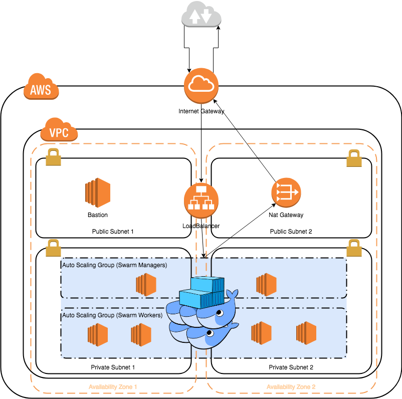

# TerracidTango
Terraform Template for AWS Infraestructure

# Setup

## Dependencies

- AWS Credentials File ([link](https://docs.aws.amazon.com/cli/latest/userguide/cli-configure-files.html))
- terraform ([link](https://www.terraform.io/downloads.html))

For more info on how Terraform visit the [Getting Starte Guide](https://learn.hashicorp.com/terraform/getting-started/install.html)
and the [Docs](https://www.terraform.io/docs). For more specific information about AWS resources
go to the [AWS Provider Documentation](https://www.terraform.io/docs/providers/aws/index.html)

## Usage

After cloning the repo, create a file called `terraform.tfvars` with your specific credentials:
```
aws_credentials_file = "~/.aws/credentials"
aws_cli_profile = "some_profile"
aws_key_name = "your-aws-key"

```
Initialize terraform
```
terraform init
```

If everything is correct the following command should output an execution plan
```
terraform plan
```

To create the infraestructure
```
terraform apply
```

To reverse everything
```
terraform destroy
```

# Overview

This template deploys a VPC accross two availability zones in the region specified (`eu-west-1` is
the default region). For each AZ there is a private and a public subnet. There is one Bastion Host
in the first public subnet to access the instances in the private subnets. There are two `t2.micro`
instances deployed, one in each private subnet, running [RancherOS 1.5](https://rancher.com/rancher-os/).
Finally, all the network plumbing and an Application Load Balancer are deployed to route the traffic
to http port 80 to the EC2 instances.

## Architecture Overview


