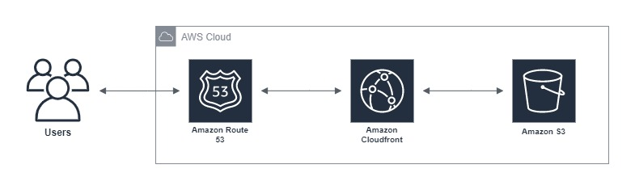

# Infrastructure

The infrastructure is created in [AWS](https://aws.amazon.com/).

To create it we use [Terraform](https://www.terraform.io/) which allows us to automate resource creation by defining them programmatically.

For more information on how Terraform works visit the [Getting Started guide](https://learn.hashicorp.com/terraform/getting-started/install.html) and the [documentation](https://www.terraform.io/docs). For more specific information about how it interacts with AWS check out the [AWS Provider Documentation](https://www.terraform.io/docs/providers/aws/index.html).

## Requirements

- You need to have Terraform installed, check the [downloads page](https://www.terraform.io/downloads.html)
- You also need some [AWS Credentials](https://docs.aws.amazon.com/IAM/latest/UserGuide/id_credentials_access-keys.html)

## Overview



We use various AWS services:

- [Amazon S3](https://aws.amazon.com/s3/) for asset storage
- [Cloudfront](https://aws.amazon.com/cloudfront/) as an asset cache to optimise asset distribution
- [Route53](https://aws.amazon.com/route53/) to manage our DNS and link the domain to our Cloudfront distribution

## Folder structure

```text
infrastructure/
├── resources/
│   ├── buckets.tf
│   ├── cloudfront.tf
│   ├── domain.tf
│   └── variables.tf
├── main.tf
├── outputs.tf
├── README.md
├── terraform.tfvars
└── variables.tf
```

- `variables.tf`: This file defines the variables required to create the infrastructure

- `main.tf`: This is where everything starts, this file defines the minimum Terraform version, the providers and the modules we have

- `terraform.tfvars`: The value for the variables defined above, DO NOT COMMIT THIS TO THE REPOSITORY

- `outputs.tf`: After running `terraform apply` this will print the configured outputs to the console

- `resources/`: This folder is a Terraform module, it holds all the resources needed for a static site
  - `variables.tf`: The variables required by the module
  - `buckets.tf`: Create the S3 buckets with the policies already configured.
  - `cloudfront.tf`: Creates the Cloudfront that uses the S3 as the source
  - `domain.tf`: Creates the domain record in Route53 and point it to the Cloudfront

## Usage

Rename the `terraform.tfvars.example` file to be `terraform.tfvars`:

```sh
mv terraform.tfvars.example terraform.tfvars
```

Modify the file to use your specific credentials:

```text
aws_access_key = "your access key"
aws_secret_key = "your secret key"
```

Initialize terraform

```sh
terraform init
```

If everything is correct the following command should output an execution plan

```sh
terraform plan
```

If everything looks good to go you can apply the changes with

```sh
terraform apply
```
